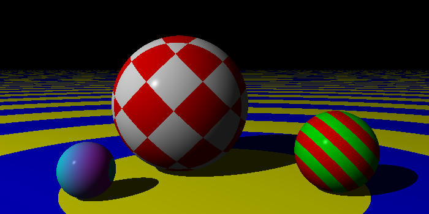

# :crab: Fe<sub>2</sub>O<sub>3</sub>-Ray :crab:

Fe<sub>2</sub>O<sub>3</sub>-Ray, or just Feoray, is a basic render engine similar to POV-Ray, which was my introduction to 3D CGI a long time ago. The 'ray' refers to this programme being a ray-tracer, and Fe<sub>2</sub>O<sub>3</sub> is ferric oxide, because this is written in Rust... :roll_eyes::facepalm:

Code is based on pseudocode provided in the book: "The Ray Tracer Challenge" by Jamis Buck, with a forward by David Buck (no relation) who is a coauthor of POV-Ray, and published by [Pragmatic Programmers](https://pragprog.com/titles/jbtracer/the-ray-tracer-challenge/).

**WARNING:** This project is still an early work in progress, so will be unuseable in its current state.

## Latest Test Render




## What's coming next?
- More patterns? Optics?

## Installation

Build the binary with the command:
```bash
cargo build --release
```

Binary is located in `target/release`.

## First Light


## Change Log

See [CHANGELOG](CHANGELOG.md).

## Features
- Camera and scenes
- Primitives: plane, sphere

### Lighting
- Point lights
- Multiple lights with individually cast shadows

### Materials
- Solid colours
- Ambient, diffusion, specular, smoothness
- Patterns: checkers, gradient, rings, and stripes

## License

This project is released under the GNU GPL-3.0 license. Check out the [LICENSE](LICENSE) file for more information.
