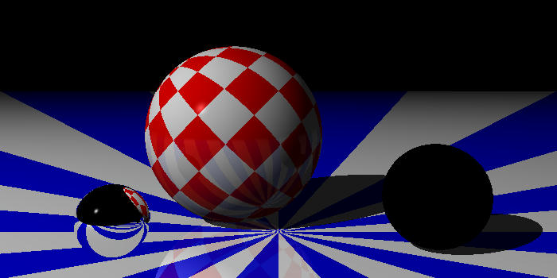

# :crab: Fe<sub>2</sub>O<sub>3</sub>-Ray :crab:

Fe<sub>2</sub>O<sub>3</sub>-Ray, or just Feoray, is a basic render engine similar to POV-Ray, which was my introduction to 3D CGI a long time ago. The 'ray' refers to this programme being a ray-tracer, and Fe<sub>2</sub>O<sub>3</sub> is ferric oxide, because this is written in Rust... :roll_eyes::facepalm:

Code is based on pseudocode provided in the book: "The Ray Tracer Challenge" by Jamis Buck, with a forward by David Buck (no relation) who is a coauthor of POV-Ray, and published by [Pragmatic Programmers](https://pragprog.com/titles/jbtracer/the-ray-tracer-challenge/).

**WARNING:** This project is still an early work in progress, so will be unuseable in its current state.

## Latest Test Render



Scene shows the latest additon to patterns (radial), uv mapping on the middle sphere, metallic material on the left sphere with shadow selectively switched off, and glass orb on the right. Reflections and refractions are currently not working properly, and I have been able to find the reason why, especially considering literally every other test passes just fine, except for tests which involve spawning secondary rays for reflections and refractions, and it's driving me nuts. The second thing to note is that if reflection tests are failing, then reflections should not show in a test render, and yet they do.


## What's coming next?
- Bug fix?

## Installation

Build the binary with the command:
```bash
cargo build --release
```

Binary is located in `target/release`.

## First Light


## Change Log

See [CHANGELOG](CHANGELOG.md).

## Features
- Camera and scenes
- Primitives: plane, sphere
- UV mapping

### Lighting
- Point lights
- Multiple lights with individually cast shadows

### Materials
- Solid colours
- Ambient, diffusion, specular, smoothness
- Patterns: checkers, gradient, rings, stripes, and radial
- Reflections and transparency (neither working properly)

## Hurdles
- I wanted to implement nested `Pattern`s, but the last attempt ended up being very messy with lots of `Box`es. I thought blended `Pattern`s would be a bit easier, and it was to a degree, but implementing it was pretty much the same problem. If I am to reattempt this, I think it would be better to implement `Material`s nested within `Pattern`s, so not only do I get `Pattern`s within `Pattern`s, I can also control individual attributes of each sub-`Pattern` such as reflectivity, roughness, etc. I may have to make special traits maybe? Some `Pattern`s are nestable, and some are terminal `Pattern`s, such as `gradient`, `solid`, or upcoming proceedurally generated `Pattern`s. That's not to mention that textures could also be applied to patterns.
- `Jitter` is currently being experimented on, but that won't be available on all `Pattern`s until I get the basics sorted out.
- UV mapping is something I plan to add very soon, as it looks simple enough. Naturally each primitive will require their own map. This also needs to be toggleable since some patterns work best without it.

## License

This project is released under the GNU GPL-3.0 license. Check out the [LICENSE](LICENSE) file for more information.
